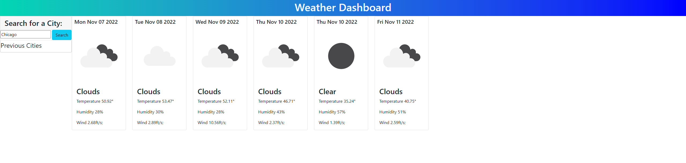

# WeatherForecast, by Mark Calcagno

## Description
A weather app that allows the user to select any city in the world and get the current weather, as well as a 5 day forecast.

## Installation
The project runs in the browser, and does not require an installation

## Usage
When the user opens the page, the page will have a search bar for cities.  When the user selects a city, the app will display the current weather and a 5 day forecast.  Upon a refresh, the user should still see the cities they requested, due to their work being located in their local storage.

## Screenshot

## Credits
Mark Calcagno
Jordy Williams, tutor

## Links
The site: https://mcalcagno47.github.io/WeatherForecast/
My github: https://github.com/mcalcagno47/WeatherForecast   

## Updates
I did not have the ability or time to complete this homework assignment and the first project at the same time.  I'm ashamed of this work.
